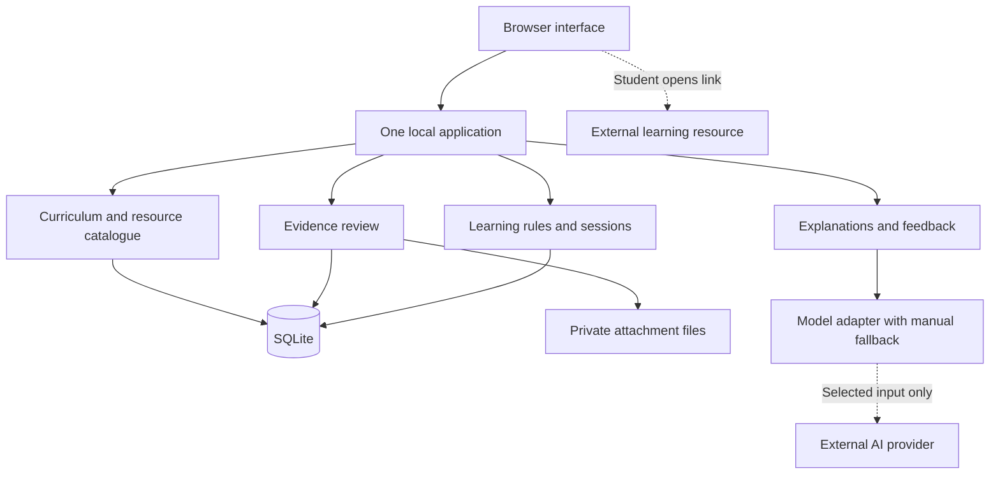

# Initial architecture review

Update 2026-10-05: the user has authorized a home-network mode and quiz encouragement points. See [D15/D16](../resources/sol/decisions.md), [home-network setup](home-network.md), and the canonical [build state](../resources/sol/BUILD_STATE.md). These changes supersede the original loopback-only boundary for that explicit mode; real-data gates remain open.

Reviewed 2026-10-02 against the original LearnPilot brief version 0.1 and the three design documents dated 2026-10-01. This is a proposed architecture and build boundary, not an implementation or a claim that all decisions are approved.

## Recommendation

Build one application, initially for one student and one Ontario Grade 9 science unit. Store a small, versioned curriculum reference, curated resource metadata, and the student's evidence locally. Derive learning status from that evidence. Link to external videos, articles, and simulations instead of hosting a teaching-content library.

Use a browser interface backed by one application process, one SQLite database, and a private attachment directory on the same computer. Keep domain rules independent of UI, storage, and the model provider. This gives useful extension boundaries without microservices or a general plugin framework.

The deployment recommendation assumes use on one trusted computer. The user has been asked whether the first version instead needs multiple devices or remote access; until resolved this is a working assumption. Local persistence does not mean local AI inference: any external model call transmits the selected input to that provider. Provide a manual path and a model-disabled mode.

## Review of the original design

| Original brief area | Finding and disposition |
| --- | --- |
| Sections 1–5, purpose and scope | Retain the evidence-to-learning loop, one student, and one unit. Define the first release around a completed learning session with later reassessment. |
| Section 6, weekly output and circuit example | A weekly summary is useful, but the student first needs an immediate next activity. Confirm the actual teacher scope before assuming advanced equivalent-resistance calculations. |
| Section 7, information model | Preserve facts, source material, and AI interpretation as separate records. The named concepts do not each require a service, class hierarchy, or separate database. |
| Sections 8–10, architecture and technology | The original React/Next.js plus FastAPI plus PostgreSQL proposal is a hypothesis. It adds two runtimes and a database service before they are needed. Recommend one runtime and SQLite for the local pilot. |
| Section 11, AI capabilities | Extraction and classification should produce reviewable drafts. Use deterministic scoring and scheduling where possible. Defer automatic generation of student-facing assessed items until validation is established. |
| Section 12, evaluation | Add a small reference set, explicit failure cases, independent unseen checks, and a restore drill. One student's improvement is useful pilot evidence, not proof of causal effectiveness. |
| Section 13, privacy | Add an actual deployment/access boundary, provider transmission rules, export/delete behavior, and backup retention. A parent/student UI switch alone is not access control. |
| Section 14, product concerns | Separate assistance, observation quality, classroom coverage, and conceptual understanding. Make correction, abstention, and contradictory evidence normal states. |
| Sections 15 and 19, discovery deliverables | Source and competitor research exists. Still needed: reviewed pilot material, precise scope and data contracts, and acceptance of the deployment/data policies. This review supplies architecture alternatives and a task inventory. |
| Section 16, phased roadmap | Replace large horizontal phases with a narrow complete loop, then improve extraction, coverage, and personalization. Keep later features explicit so they do not enter the first build accidentally. |
| Sections 17–18, repository and working principles | Keep a small documentation set and record meaningful decisions. Prefer small complete tasks with acceptance checks for the implementation model. |
| Sections 20–21, early success and delivery experiment | Retain measurable learning support and iterative delivery. Track review burden and failures, not just successful demonstrations. |
| Later user additions | Resource selection, student choice, and specific encouraging feedback are first-release behavior, not optional polish. External-resource engagement remains separate from learning evidence. |

The main tension is between a small pilot and the accumulated feature list. Resolve it by building minimum versions of evidence review, practice, feedback, and reassessment together. Broad curriculum ingestion, free-form tutoring, school integrations, and automatic content generation can follow.

## Three candidate initial use cases

| Use case | Value | Main dependency | Decision |
| --- | --- | --- | --- |
| Review a marked assessment, address one difficulty, reassess | Tests the distinctive learning loop with real evidence | A reviewed assessment and original follow-up items | Recommended pilot |
| Introduce an unfamiliar topic with a resource and short practice | Low friction, supports a student without past work | Reviewed resource and small item bank | Include as a cold-start route in the same session flow |
| Plan a week around upcoming tests and multiple subjects | Useful organization, but needs wider reliable context | Multiple units, deadlines, history, priorities | Later expansion |

## What should be stored

| Data | Initial location | Purpose and lifecycle |
| --- | --- | --- |
| Official course/version, expectation IDs and permitted exact wording for the selected unit | Versioned curriculum pack imported into SQLite | Stable grounding and repeatable mapping. Keep versions referenced by historical evidence; review updates explicitly. |
| Official source provenance | Metadata in SQLite; permitted source PDF or relevant source extract in reference files | Record URL, publication/version, retrieval date, locator, attribution, hash, and permission. A whole official PDF is optional provenance if permitted, not a mandate to mirror a website. |
| LearnPilot concept names, prerequisite links, original explanations and item bank | Small versioned content pack | Original application content. Label mappings and explanations as LearnPilot-authored, not official curriculum text. |
| Khan Academy, YouTube, TVO, PhET resources | URL and reviewed metadata only | Keep topic, purpose, format, language, limitations, review date, and link status. Do not download video/audio/transcript libraries. |
| Student profile, preferences, classroom coverage and dates | Private SQLite records | Minimal identifiers, no school identity or birth date unless a justified feature requires them. |
| Uploaded classroom work | Private local files plus database metadata | Preserve the evidence needed for review, subject to retention/deletion choices. Exclude other students' information. Never put uploads in a public static directory. |
| Reviewed extracted questions, responses, marks and rubric results | Private SQLite records | Durable evidence with source locations and revision lineage; manual entry is a supported source with its own provenance. |
| Practice attempts, hint use, retries, answer exposure and review results | Private SQLite records | Preserve actual observations and assistance conditions. |
| AI interpretations and recommendations | Private SQLite records | Store structured accepted/draft results, supporting evidence IDs, model/prompt version, and review status. Avoid retaining unnecessary raw prompts or sensitive debug traces. |
| Current learning state and session plans | Private SQLite records, derived and replaceable | Recompute from reviewed evidence using a versioned rule policy. Never retain a status as the only record of understanding. |
| Temporary extraction output and transient model failures | Bounded private temporary storage | Explicit expiry and cleanup; do not convert every intermediate response into permanent student memory. |
| Backups and exports | User-selected protected destination | Consistent database plus required files and manifest. App-managed retention is bounded; disclose that user-created external copies are outside automatic deletion. |

The curriculum pack is an application reference, not a disposable cache while historical evidence depends on it. Resource metadata can be refreshed without rewriting what an earlier session used. Historical recommendations should retain the resource version/metadata they referenced.

### Why personal status alone is insufficient

If the app stores only “needs practice in resistance,” it cannot show whether that judgment came from a blurry scan, a correct answer with a hint, or a genuine misconception. It also cannot reliably recover from corrections or a changed scoring policy. The minimum private record is reviewed evidence plus attempts and interpretations, with status as a summary.

### Public-data alternatives

| Strategy | Benefits | Costs and weaknesses | Decision |
| --- | --- | --- | --- |
| Fetch curriculum and resources live for every task | Few reference files | Network dependency, changing pages, hard-to-reproduce mappings, repeated extraction | Reject for authoritative runtime grounding |
| Small pinned curriculum pack plus external resource links | Repeatable, available offline for core work, easy to inspect | Requires selective review, rights tracking, and version updates | Recommended |
| Mirror textbooks, videos, all curricula and exercises | Broad local library | Rights, storage, indexing, freshness and ingestion burden | Defer; likely unnecessary |

Ontario's general copyright guidance permits unchanged attributed reproduction for noncommercial purposes, with exceptions and other uses requiring further consideration. Confirm the exact source and intended use before distributing a curriculum pack. Keep original wording separate from annotations. If permission to store text is unresolved, retain identifiers, URLs and permitted metadata. Track rights clearance separately from mapping review: a reviewer can verify a mapping against the live official source without storing its wording, but this offers weaker offline provenance. Mark alignment unverified only when the underlying source/mapping has not been reviewed. [Ontario copyright](https://www.ontario.ca/page/copyright-information)

## Small application structure

These are modules in one codebase, not independently deployed services. Start with explicit functions and typed inputs/outputs; do not build an abstract workflow engine. Transactions own related data changes. External calls occur outside database transactions and their results are validated before commit.

Keep four boundaries clear:

- Domain rules operate on typed evidence and content records, with no direct provider SDK or UI dependencies.
- Storage functions own SQL and transaction behavior. Separate attachment access behind a small file-store interface.
- Model operations return validated drafts such as extraction proposals or explanations. They cannot directly update learning state.
- The catalogue supplies approved curriculum, items and resources; selection resolves known IDs rather than accepting model-invented URLs or expectation codes.

An assessment attempt is evidence; an error explanation is an interpretation. A recommendation cites the evidence and catalogue versions used. A student's challenge creates a review correction, not an unexplained overwrite.

## Implementation options

| Option | Operational footprint | Tradeoff | Recommendation |
| --- | --- | --- | --- |
| One TypeScript web application, for example Next.js server and UI, plus SQLite | One application process, database file, attachments | Good fit for interactive review and later web hosting; document extraction needs an initial format boundary | Preferred provisional stack |
| One Python web application with templates and modest browser JavaScript, plus SQLite | One application process, database file, attachments | Attractive if document processing dominates; rich interactions may take more UI work | Valid alternative if maintainers prefer Python |
| Separate React/Next.js, FastAPI, and PostgreSQL services | Two application runtimes and database service | Stronger specialization but more deployment, configuration and failure paths | Defer until a concrete requirement justifies it |

A browser-only application is not the default: it would still need a safe solution for provider credentials and durable recovery, and would bind persistence more closely to browser storage. A native desktop wrapper is also unnecessary for the first loop.

Next.js supports a self-hosted Node server; its hosted deployment does not have to be selected now. Runtime and library versions must be pinned and checked during setup. A SQLite deployment needs persistent writable storage and one designated application owner of that file, not an ephemeral serverless filesystem. [Next.js self-hosting](https://nextjs.org/docs/app/guides/self-hosting)

SQLite is suited to local application storage. Keep the database on the same host as the application process and never share the live file between computers through a sync folder. Move to a client/server database when measured concurrent writes, multiple application instances, or deployment requirements justify it. Adding another course alone does not. [SQLite appropriate uses](https://www.sqlite.org/whentouse.html)

## Essential data and behavior contracts

Use stable IDs for student, course/version, expectation, concept, source, question/version, attempt, interpretation, and session. Foreign keys and transactions protect relationships. Add timestamps, record revision, and relevant policy versions. Do not use URLs, display names, or a model's prose as primary identifiers.

1. Import: validate type/size → store privately → create draft extraction → review/correct → publish reviewed evidence → recompute affected state. Failed or unreviewed extraction has no learning-state effect.
2. Correction: create a new evidence revision → supersede the old revision → invalidate dependent interpretations/plans → recompute using eligible evidence. Preserve historical explanation with clear superseded labels until deletion rules require removal.
3. Attempt: save answer, assistance, item version and mode together. Duplicate submissions use a stable submission key and produce one effective attempt. Practice and reassessment modes are distinct.
4. State: keep classroom coverage, observed performance, evidence sufficiency, and review-due date as separate fields. Time alone can make review due, not prove understanding was lost. A previously demonstrated concept with contradictory new evidence is marked for review.
5. Recommendation: select a taught/current target or a declared introduction goal → check prerequisites → choose reviewed resources/items → show reason → save session → gather feedback → schedule an independent later check.
6. Failure: model unavailable, malformed output, or uncertain source results in a visible retry/manual path. Existing evidence and ordinary practice remain usable. Retrying AI extraction does not imply a second student attempt.

A first learning-state policy should use descriptive states and explicit evidence rules, not a psychometric percentage. For the pilot, a reviewed independent response on an unseen item can be labelled “demonstrated on this item”; broader concept-level confidence requires a declared coverage rule and later evidence. Do not invent a validated mastery threshold before the pilot.

For numerical practice, define acceptable units, tolerances and equivalent forms with the item. For explanations and diagrams, use a reviewed rubric and label any model assessment as tentative until reviewed. Simulation completion does not certify physical laboratory competence.

## Reliability and privacy from the first usable release

- Save attempts and review actions transactionally before requesting AI evaluation; acknowledge success only after commit. Enable and verify SQLite foreign-key enforcement on every connection. Handle interrupted imports and duplicate clicks.
- Maintain schema migrations. Back up before migrations and preserve a recovery path for failed upgrades. Verify an old fixture migrates and remains usable.
- Back up the database using a supported consistent snapshot method, with a manifest and the referenced attachments. Briefly pause relevant writes/deletions during the initial single-user backup to ensure a coherent set. Verify restore into an empty instance. A database-only backup loses source evidence. [SQLite backup methods](https://www.sqlite.org/backup.html)
- Bind the local pilot to loopback and validate request origin/host and mutation requests. Store keys server-side. Keep files outside static serving paths and prevent path traversal. A trusted OS session is the initial access boundary; it does not provide separate parent/student secrecy.
- Apply private/no-store behavior to student pages and responses; shared framework caches must not contain personal records. Use minimal diagnostic logs with identifiers and error codes rather than student work.
- Show which data would leave the device for AI processing, allow disabling it, and configure request/output limits and a per-operation retry cap. Review provider handling before real student material is sent.
- Provide export and deletion covering attachments, extracted work, attempts, dependent interpretations, derived state, and app-controlled caches. Deletion takes precedence over retaining an audit history of private content. Remove or sanitize affected app-managed backups under the agreed policy; warn that restoring an older external backup can reintroduce previously deleted data and require an explicit restore decision. Do not promise secure erasure from every SSD or external copy.
- Pin and update dependencies deliberately. Test upload parsing, authorization assumptions, corrections, failures, restore, and the complete learning loop. Avoid elaborate observability infrastructure for one student.

The app should run core reviewed-content practice without internet. External videos and cloud AI remain unavailable offline; explain that boundary and provide original text/practice alternatives. Multi-device synchronization is a separate future feature.

## How the architecture can grow

| New requirement | Smallest justified change | Keep stable |
| --- | --- | --- |
| Another unit or subject | Add a reviewed versioned content pack | Evidence IDs, session flow, catalogue contracts |
| Better PDF/handwriting extraction | Replace or extend extraction adapter and review UI | Reviewed evidence contract |
| More personalized explanations | Add a model operation and evaluated prompt | Evidence rules and provider-independent outputs |
| More than one student | Add authenticated accounts, authorization and isolation tests before enabling it | Student-scoped records and domain rules |
| Access from phones or away from home | Host one app with persistent storage, HTTPS, accounts and recovery; reassess data residency | Domain modules and data export contracts |
| Multiple servers or sustained write contention | Migrate persistence to PostgreSQL with reconciliation tests | Domain IDs and semantics; SQL still needs migration work |
| Large permitted document collection with poor structured search | Evaluate full-text search, then embeddings only if measured retrieval improves | Source provenance and permission checks |
| Slow/repeated background imports | Introduce a durable job runner when in-process retry is insufficient | Import state and idempotency rules |

Flexibility comes from clear records, explicit boundaries, and migrations. It does not require implementing every future adapter, a message bus, an event-sourced system, a graph database, or autonomous agents now.

## Decision status

Recommended now: small pinned references plus private evidence; external resource links; one application; SQLite and private files; reviewed evidence before inference; provider boundary; backup/restore and correction support.

Still to confirm: first device/access pattern, current classroom unit, reviewer availability, exact allowed source material, retention/visibility policy, and whether real-data AI calls are permitted. The proposed TypeScript stack is a default for a future build, not an irreversible decision. See [task backlog](task-backlog.md) for all architecture workstreams, dependencies, build tasks, and gates.
